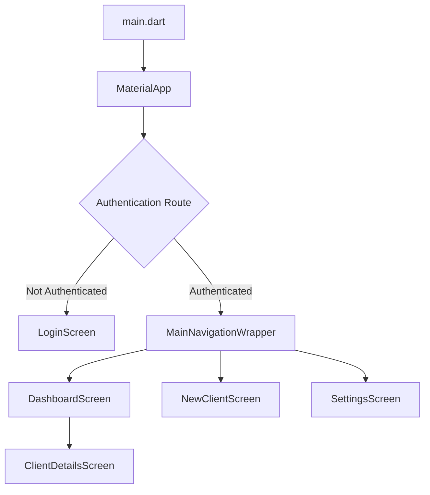
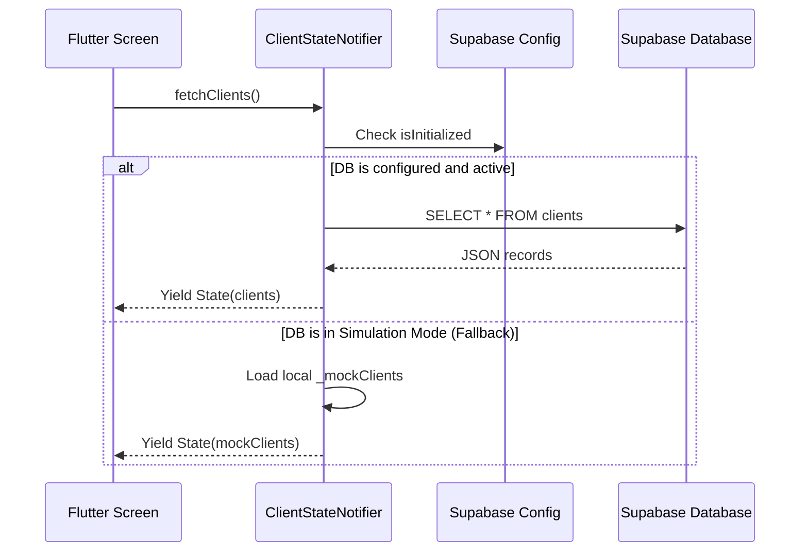

# 🌟 TFC Financial CRM - Project Working & Handover Guide

Welcome to the **TFC Financial CRM** (The Future Club) technical working document and live status tracker. This guide highlights the system's architecture, recent feature integrations, data flows, and active blueprints.

---

## 🏗️ 1. System Architecture & Tech Stack

This project is built as a state-of-the-art, premium **Arabic-First Financial CRM** utilizing:
* **Core Framework:** Flutter (SDK `>=3.2.0 <4.0.0`)
* **State Management:** Flutter Riverpod (`^3.3.1`) for robust, decoupled status handling and dependency injection.
* **Database & Auth Backend:** Supabase via `supabase_flutter` (`^2.12.4`).
* **Design Language:** Dynamic Glassmorphism UI (utilizing customized `GlassCard` widgets, HSL custom colors in `core/theme.dart`, and smooth micro-animations).
* **Logging & Localization:** Robust error-handling with `logger` and fully-configured Arabic localizations out-of-the-box.



---

## ⚡ 2. Current Implementation Status

### 🧭 [COMPLETED] Feature: 3-Step Wizard Form (Stepper UI)
The new client onboarding flow is structured as a **3-step wizard** with animated step indicators and navigation buttons:
* **Step 1 — البيانات الشخصية:** Personal data (name, phone, national ID, employment, salary transfer).
* **Step 2 — البيانات الائتمانية:** Credit data (existing loans, credit cards/applications).
* **Step 3 — المستندات والطلب:** Document uploads and financing request details.
* **Visual Indicators:** Active/completed step circles with connecting lines and RTL layout.

### 📱 [COMPLETED] Feature: Secondary Phone Number Integration
To enhance client reachability and ease banking follow-ups, we have successfully integrated a dynamic secondary/alternate phone number option across the client onboarding and review pipeline.

* **Model Layer:** Exposes optional `secondaryPhoneNumber` in `ClientModel`.
* **UI Layer:** Dynamic animated input toggle in Step 1 using `AnimatedSize` with smooth expand/collapse.

### 💰 [COMPLETED] Feature: Dynamic Salary Transfer & Auto-filled Date
* **Request Date:** Automatically pre-filled with today's date in `YYYY-MM-DD` format under a beautiful read-only grid layout in Step 3.
* **Representative Name:** Auto-populated from the currently logged-in user via `authProvider`.
* **Salary Input Modes:**
  * *Bank Transfer:* Shows dynamic repeatable bank rows (Bank Name + Salary Amount) with real-time add/remove triggers.
  * *Cash/Cheque:* Auto-contracts to show a single cash salary field.
* **Logging:** Dynamic serialization of salary entries saved in the client's Interaction Log notes in both live SQL and sandbox simulations.

### 💳 [COMPLETED] Feature: Advanced Credit Cards Bento Sub-Cards
* **5% Auto-Calculated Limit:** When typing a credit limit in "قيمة الليمت", the next field calculates and displays 5% of the limit in real-time.
* **Refined Types:** Edited card type options to be `'card'` (بطاقة) and `'request'` (أبلكيشن).
* **Conditional Installment Field:** The installment input ("قيمة القسط") is dynamic, only appearing when "أبلكيشن" is chosen.
* **Highest Value Auto-Calc:** The "الحد الأعلى" field automatically calculates `max(5%, installment)` for each card entry.
* **Duration & Notes:** Added "المدة" and "ملاحظات إضافية" fields directly inside the GlassCard sub-card layout, preventing visual clutter while supporting infinite additions.

### 📊 [COMPLETED] Feature: Credit Summary Dashboard (DBR Calculator)
A real-time credit summary card that appears in Step 2 when loans or cards are added:
* **8 Summary Tiles:** إجمالي أقساط القروض, إجمالي 5% البطاقات, إجمالي الالتزامات بـ 5% (مجموع أقساط القروض مع 5% البطاقات), الحد الأعلى للبطاقات, إجمالي الالتزامات الشهرية, حد الـ DBR المسموح (50%) (مجموع الراتب مقسوماً على 2), نسبة عبء الدين (DBR), المتاح لقسط جديد.
* **DBR Calculation:** `(Total Monthly Obligations / Total Salary) × 100`, with a 50% ceiling as the maximum allowed debt burden.
* **Visual Progress Bar:** Color-coded DBR indicator — green (<35%), amber (35%-50%), red (>50%).
* **Auto-Recalculation:** All values update in real-time via controller listeners on loans, cards, and salary fields.

### 📄 [COMPLETED] Feature: Document Upload UI (Mock)
* **Step 3 Upload Cards:** Three upload boxes for (1) وجه بطاقة الرقم القومي, (2) ظهر بطاقة الرقم القومي, (3) مستندات أخرى.
* **Toggle State:** Click-to-toggle upload status with animated icon and status text changes.
* **Responsive Grid:** Adapts from 3-column to 1-column layout on smaller screens.

### 🗺️ [COMPLETED] Feature: Governorate Selection
* **Dropdown:** Pre-populated governorate list (القاهرة, الجيزة, الإسكندرية, الدقهلية, الرياض, جدة) in Step 3.

### 📊 [COMPLETED] Feature: Client Details Screen Credit Summary Integration
* **Visual Bento Box:** Integrated a sleek, modern, glassmorphic credit summary dashboard inside `ClientDetailsScreen` right above the detailed loans & cards section.
* **Auto Salary Extraction Parser:** Added a high-precision regex parser that extracts the client's salary directly from the client's structured history logs (supporting both Cash salary deposits and dynamic Bank Transfer lists) with a reliable fallback for mock seeded client accounts.
* **8 Metric Bento Grid & DBR Indicator:** Renders all 8 calculated metrics (Loans, Cards, Obligations, Limits, DBR Limits, DBR% and Available loan amount) matching the step onboarding design.
* **Dynamic Color Progress Bar:** Real-time indicator displaying the debt burden risk visually (Green/Amber/Red).
* **Fully Responsive Support:** Dynamically scales across both desktop dual-column grids and mobile stacked forms.
* **Secondary Phone Display:** Beautifully displays the client's alternative phone number inside the personal details card whenever present.

---

## 🔄 3. Data & State Flow Guide

The application features a hybrid offline/online dynamic database fallback to guarantee high availability and smooth sandbox execution:



---

## 🛡️ 4. Role-Based Permissions & Guards

Permissions are centralized in `permissions_provider.dart` using strong role definitions (`manager`, `company_employee`, `bank_employee`):

| Permission | Manager (`manager`) | Company Employee (`company_employee`) | Bank Employee (`bank_employee`) |
|---|:---:|:---:|:---:|
| **canViewClients** | ✅ Yes | ✅ Yes | ✅ Yes |
| **canEditClients** | ✅ Yes | ✅ Yes | ❌ No |
| **canDeleteClients** | ✅ Yes | ❌ No | ❌ No |
| **canApproveLoans** | ✅ Yes | ❌ No | ✅ Yes |
| **canViewAnalytics** | ✅ Yes | ❌ No | ✅ Yes |
| **canManageRoles** | ✅ Yes | ❌ No | ❌ No |

---

## 🚀 5. Getting Started & Running Locally

1. **Verify Flutter Environment:**
   ```powershell
   flutter doctor
   ```
2. **Install Dependencies:**
   ```powershell
   flutter pub get
   ```
3. **Run in Sandbox / Simulator Mode:**
   * The app defaults to sandbox simulation if Supabase keys aren't registered. Just run:
   ```powershell
   flutter run -d chrome
   ```
   * Or for Windows Desktop:
   ```powershell
   flutter run -d windows
   ```

---

## 📝 6. Next Steps & Development Roadmap

* [x] **Database Schema Alignment & Parity:** Added `field_visibility` column to SQL schema, resolved name mappings like `created_by_name` in Dart models, and verified parity.
* [x] **Verification Tests Lint Fixes:** Addressed all IDE warnings regarding `print` statements in test scripts.
* [ ] **Supabase Remote Integration:** Link live keys in `core/supabase_config.dart` and deploy SQL scripts from `supabase_schema.sql` to production.
* [ ] **Document Storage Pipeline (Backend):** Connect the existing upload UI to active Supabase Bucket uploading for ID Cards and Bank statements. *(UI is already implemented — backend pending)*.
* [ ] **Automated I-SCORE Calculator:** Extend the existing DBR/credit summary engine with background evaluation of dynamic installment values / card request limits against requested loan amounts to produce an automated credit score. *(Calculation skeleton exists — scoring logic pending)*.

